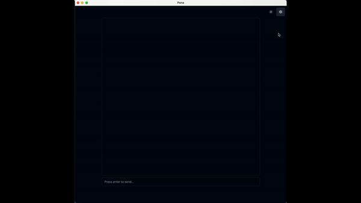

<h1 align="center">
Pana 

</h1>

<!--  -->

A locally hosted desktop assistant leveraging LLMs, enabling offline question-answering with complete data privacy.

## Demo

  

## Installation

You can find the installer/bundle for your operating system on [release page](https://github.com/nubiv/pana/releases). Please note that the current version is not stable yet, and you may encounter various bugs.

🔔 NB: For windows users, it may be necessary to run the application as admin because model downloading feature requires read and write access to the resource path.

## TechStacks

- [tauri](https://github.com/tauri-apps/tauri)
- [llm](https://github.com/rustformers/llm)
- [llm-chain](https://github.com/sobelio/llm-chain)
- [svelte-kit](https://github.com/sveltejs/kit)
- [shadcn-svelte](https://github.com/huntabyte/shadcn-svelte)
- [tailwindcss](https://github.com/tailwindlabs/tailwindcss)

## Prerequisites

Before getting started with this project, ensure that you have the following prerequisites installed on your machine:

1. Node.js: Make sure you have Node.js installed. You can download it from the official website: https://nodejs.org.

2. Rust: Tauri is powered by Rust, so you'll need to have Rust installed. You can install Rust by following the instructions on their website: https://www.rust-lang.org.

Once you have these prerequisites installed, you're ready to start working with Tauri and building your applications.

## Getting Started

1. Clone this repository to your local machine.
2. Navigate to the project directory.
3. Install dependencies using your preferred package manager, e.g. `npm install` or `yarn install`.

## Development

To start the development server, run `npm run tauri dev`, or `cargo tauri dev` if you have Tauri CLI installed. This will launch the Tauri application and open a development window. Any changes you make to the source code will automatically reload the application.

## Build

To build the application from source, run `npm run tauri build`, or `cargo tauri build` if you have Tauri CLI installed. This will build the application for your current platform.

## Roadmap

- [x] In-app model downloading
- [ ] Local interaction with LLM models
  - [ ] Contextual conversation with embedded chat history store
  - [ ] Customizable LLM model parameters
- [ ] Lang-chain tool integration
  - [ ] Search functionality to quickly locate information within the document
  - [ ] Summarization of lengthy documents
- [ ] Extensible plugin system for Lang-chain tools
- [ ] Clean and intuitive UI for daily use

## Contributing

Contributions are always welcome! Please submit a pull request to `dev` branch and make sure it passes CI check if you'd like to contribute to this project.

## License

`Pana` is licensed under the [MIT License](LICENSE.md).

<!-- ## Connect

If you have any questions, suggestions, or feedback, feel free to open an issue or join [discord](https://discord.gg/Ryc9Cbws). -->
